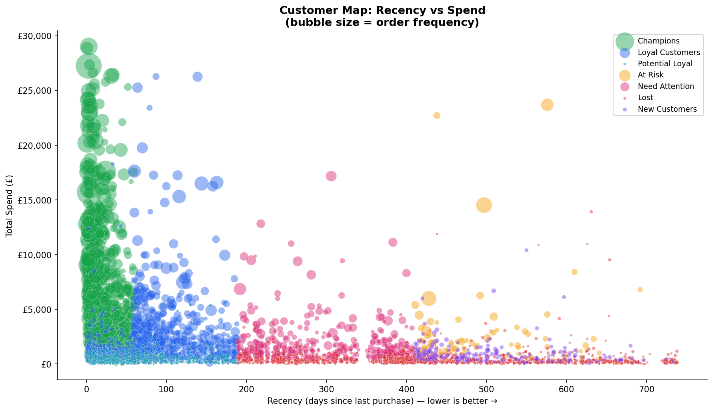
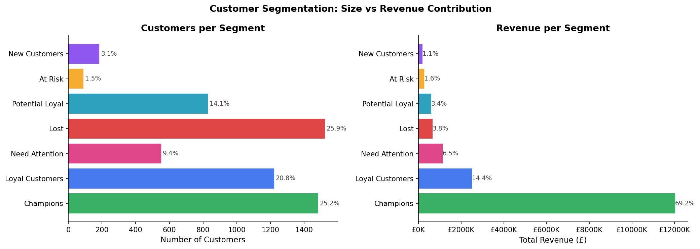
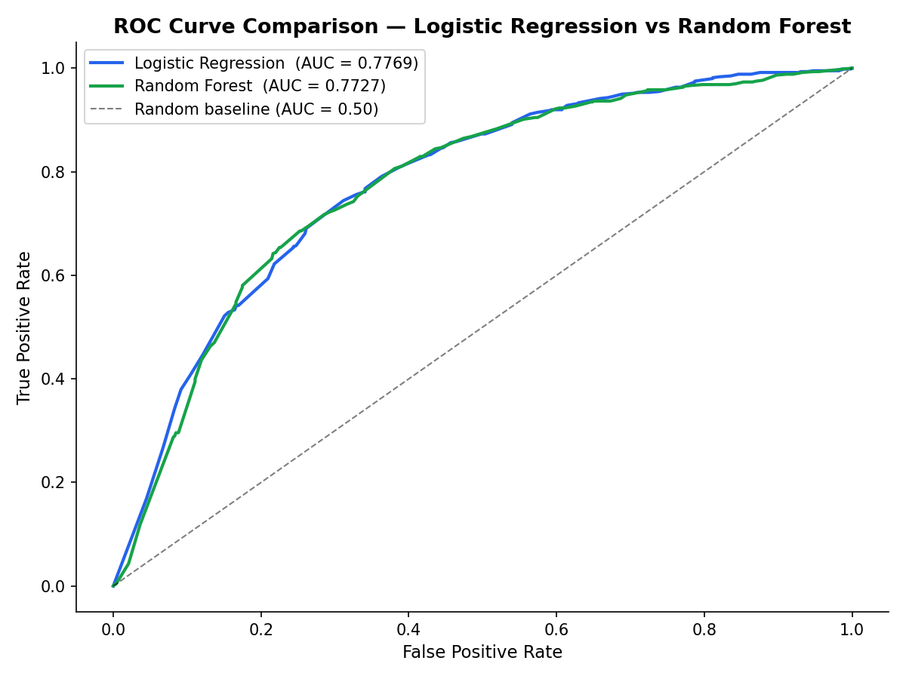

# Customer Lifecycle & Campaign Effectiveness Analysis
**E-commerce Marketing Analytics | Python · SQL · RFM · Machine Learning · Attribution**

---

## Overview

An end-to-end marketing analytics project analysing 1,067,371 transactions from a 
UK-based e-commerce retailer to answer four core business questions:

1. **What does our data look like?** — EDA & cleaning to build a trusted analytical foundation
2. **Who are our customers?** — RFM segmentation to identify high-value, at-risk, and lost tiers
3. **Who will churn?** — Predictive churn model to enable proactive retention
4. **Which channels drive value?** — Campaign attribution to optimise marketing spend

Findings are translated into actionable CRM and paid media recommendations — 
bridging data analysis with real-world marketing strategy using Klaviyo lifecycle 
flows and Google Ads audience targeting.

---

## Project Structure
```
├── notebooks/
│   ├── 01_eda.ipynb                  # Data cleaning & exploratory analysis
│   ├── 02_rfm_segmentation.ipynb     # RFM scoring & customer personas
│   ├── 02b_sql_analysis.ipynb        # SQL queries against transaction & RFM database
│   ├── 03_churn_model.ipynb          # Churn prediction (Logistic Regression & Random Forest)
│   └── 04_campaign_attribution.ipynb # Channel attribution & ROI analysis
├── data/
│   └── data_source.md                # Dataset info & download instructions
├── outputs/                          # Charts and model outputs
├── strategy_recommendations.md       # CRM & paid media strategy layer
└── README.md
```

---

## Notebooks

| Notebook | Description |
|---|---|
| `01_eda.ipynb` | Exploratory data analysis — cleaning 1M+ rows, feature engineering, revenue patterns |
| `02_rfm_segmentation.ipynb` | RFM scoring, 7-segment customer model, Klaviyo & Google Ads action mapping |
| `02b_sql_analysis.ipynb` | SQL analysis — 8 queries across JOINs, window functions, churn cross-referencing |
| `03_churn_model.ipynb` | Logistic Regression churn prediction, £5.5M revenue at risk quantified |
| `04_campaign_attribution.ipynb` | First-touch, last-touch and linear attribution across 5 marketing channels |

---

## Key Findings

- **Top 20% of customers generate 77.2% of total revenue** — Pareto effect confirmed
- **Champions (25.2% of base) drive 69.2% of revenue (£12,024,330)** — highest retention priority
- **Churn model ROC-AUC: 0.777** — Logistic Regression outperformed Random Forest (0.773)
- **Frequency is the strongest churn predictor** — order behaviour beats spend value as a loyalty signal
- **512 Champions flagged as early warning** — active (avg 24 days recency) but showing drift signals
- **At Risk segment: 89 customers, avg spend £3,028, avg 493 days silent** — manual CRM override required, model underestimates churn risk due to feature design
- **Peak trading window: Thursday 11am–1pm** — primary Google Ads bid scheduling & Klaviyo send-time
- **Total revenue at risk across churn segments: £5,503,679**
- **Top international markets: Netherlands, EIRE, Germany** — European expansion priority

## Visual Highlights







---

## Tools & Techniques

- **Python:** Pandas, NumPy, Scikit-learn, Matplotlib, Seaborn
- **SQL:** SQLite — JOINs, window functions, GROUP BY aggregations, subqueries
- **ML Techniques:** Logistic Regression, Random Forest, ROC-AUC evaluation
- **Analytics:** RFM Analysis, Churn Prediction, Multi-touch Attribution
- **Marketing Frameworks:** Customer Lifetime Value, Lifecycle Segmentation, 
Google Ads Customer Match, Klaviyo Flow Architecture

---

## Strategy Recommendations

See [`strategy_recommendations.md`](./strategy_recommendations.md) for the full findings and action plan, including:

- **£5.5M revenue at risk** quantified across five segments with churn probabilities
- **CRM flows** mapped to each RFM segment — Champions VIP retention, Loyal reward flow, At Risk manual override
- **Google Ads strategy** — Customer Match, RLSA bid boosts, win-back display, and negative audience suppression
- **Budget reallocation** recommendation based on attribution analysis — Social underperforms across all three models
- **Methodology notes** covering data cleaning decisions, model selection rationale, and attribution approach

---

## Dataset

**Online Retail II — UCI Machine Learning Repository**  
~1M transactions | UK-based retailer | Dec 2009 – Dec 2011  
[Download here](https://archive.ics.uci.edu/dataset/502/online+retail+ii)
